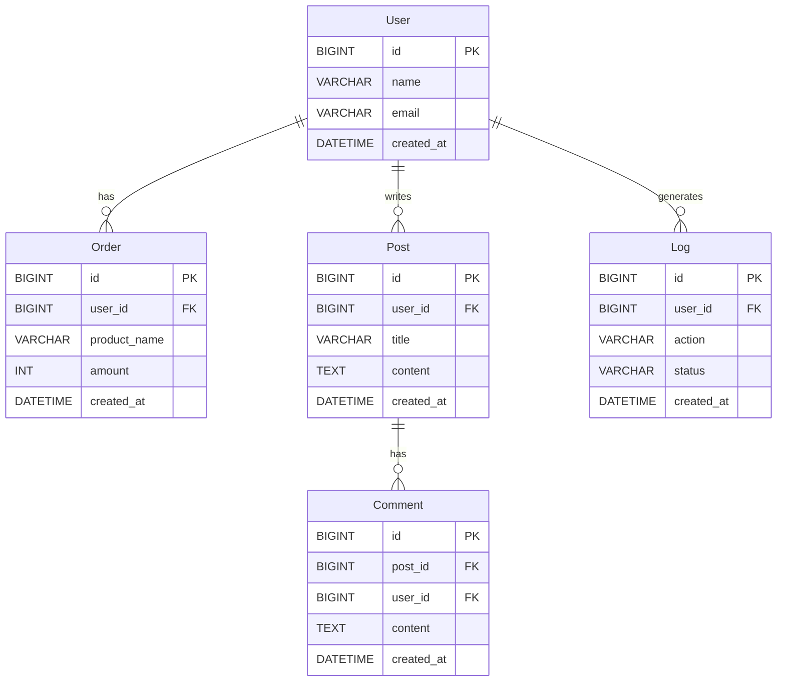

# SQL Lab ERD — 엔티티 관계 및 인덱스 전략

## 엔티티 관계 다이어그램



---

## 인덱스 전략 (Before / After)

| 시나리오 | 대상 테이블 | Before (인덱스 없음) | After (인덱스 추가) |
|---------|------------|---------------------|-------------------|
| Full Table Scan | users | 없음 | `idx_users_name ON users(name)` |
| 인덱스 무력화 | orders | `created_at` 단순 인덱스 | `idx_orders_created_at` (범위 조건 활용) |
| 복합 인덱스 순서 | logs | `idx_logs_created_at` | `idx_logs_status_created_at ON logs(status, created_at)` |

---

## 인덱스 DDL 예시

```sql
-- 시나리오 1: Full Table Scan 개선
-- users.name 컬럼에 단일 인덱스 추가
CREATE INDEX idx_users_name ON users(name);

-- 시나리오 2: 인덱스 무력화 개선
-- orders.created_at 컬럼에 단일 인덱스 추가 (범위 조건과 함께 사용)
CREATE INDEX idx_orders_created_at ON orders(created_at);

-- 시나리오 4: 복합 인덱스 순서 개선
-- logs 테이블에 (status, created_at) 복합 인덱스 추가
-- 선행 컬럼(status)을 조건에 포함해야 인덱스가 활용됨
CREATE INDEX idx_logs_status_created_at ON logs(status, created_at);
```

---

## 관련 문서 링크

- `./PRD.md` — 시나리오별 학습 목표 및 API 엔드포인트 정의
- `../DEVELOP_SETTING_GUIDE.md#sql-lab-설정` — 시드 데이터 및 EXPLAIN 실행 방법
- `../scenarios/README.md` — 분석 결과 기록 템플릿
- `../README.md` — 전체 학습 경로
