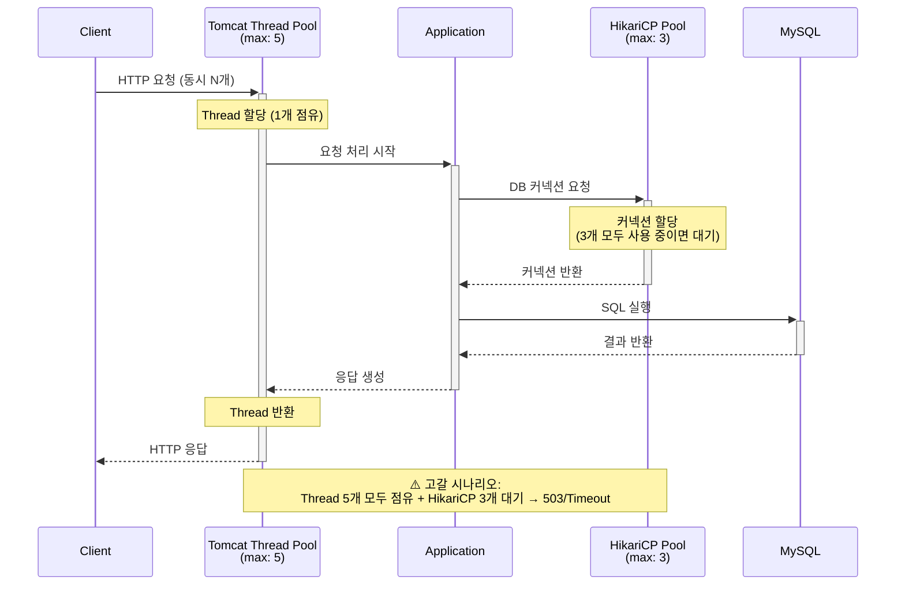

# Thread Lab PRD

## 목적 및 학습 목표

- Thread Pool과 Connection Pool 고갈 현상을 직접 재현하고 Actuator 메트릭으로 모니터링하는 능력
- Tomcat Thread Pool과 HikariCP Connection Pool의 관계 이해
- `@Async` TaskExecutor 설정 및 큐 적체 원인 분석 능력
- pool 크기 설정이 서비스 안정성에 미치는 영향 체험

---

## 재현 시나리오

### 시나리오 1. Tomcat Thread 고갈

**엔드포인트**: `GET /thread/slow-api`

| 구분 | 상태 | 설명 |
|------|------|------|
| Before | 문제 있는 상태 | `Thread.sleep(5000)` 으로 요청당 5초 점유 → 동시 요청 시 thread 고갈 → 503 발생 |
| After | 개선 상태 | 비동기 처리 또는 timeout 설정으로 thread 점유 시간 단축 |

- **Before 증상**: Tomcat thread max(5) 환경에서 동시 6번째 요청부터 503 또는 큰 응답 지연 발생
- **After 효과**: thread 반환이 빨라져 동시 요청을 정상 처리
- **관찰 메트릭**: `tomcat.threads.busy` / `tomcat.threads.config.max`

---

### 시나리오 2. @Async Queue 적체

**엔드포인트**: `POST /thread/async-task`

| 구분 | 상태 | 설명 |
|------|------|------|
| Before | 문제 있는 상태 | `ThreadPoolTaskExecutor`의 queueCapacity 초과 → `TaskRejectedException` 발생 |
| After | 개선 상태 | queueCapacity 및 maxPoolSize 조정, 또는 `RejectedExecutionHandler` 설정으로 안전한 거부 처리 |

- **Before 증상**: 큐가 가득 차면 태스크 제출 시 `TaskRejectedException` 예외가 발생하며 요청 실패
- **After 효과**: 큐 크기와 최대 풀 사이즈를 조정하거나 핸들러를 등록해 예외 없이 과부하를 처리
- **관찰 메트릭**: `executor.queued` / `executor.active`

---

### 시나리오 3. HikariCP 고갈

**엔드포인트**: `GET /thread/db-heavy`

| 구분 | 상태 | 설명 |
|------|------|------|
| Before | 문제 있는 상태 | DB 커넥션을 장시간 점유 → `hikari.connection-timeout` 초과 → `HikariPool-1 - Connection is not available` 에러 |
| After | 개선 상태 | 커넥션 반환 지연 원인 제거 또는 pool size 증가로 해결 |

- **Before 증상**: 커넥션 풀(max 3)을 초과하는 동시 요청 시 대기 시간이 `connectionTimeout`을 넘어 예외 발생
- **After 효과**: 커넥션이 즉시 반환되거나 풀 크기가 충분해 대기 없이 할당
- **관찰 메트릭**: `hikaricp.connections.active` / `hikaricp.connections.pending`

---

### 시나리오 4. Thread/DB Pool 불균형

**엔드포인트**: 부하 테스트 시나리오 (k6 스크립트 활용)

| 구분 | 상태 | 설명 |
|------|------|------|
| Before | 문제 있는 상태 | Tomcat thread max(5) > HikariCP max(3) → thread는 있으나 DB 커넥션이 없어 대기 |
| After | 개선 상태 | 두 pool 크기의 균형 있는 설정 (일반적으로 hikari max ≥ tomcat thread max) |

- **Before 증상**: thread가 DB 커넥션을 기다리며 connection wait time이 증가하고 전체 처리량 저하
- **After 효과**: pool 비율 균형 조정 후 connection wait time이 0에 수렴하고 TPS 정상화
- **관찰**: connection wait time 증가 패턴 및 두 풀의 active/pending 상관관계

---

---

## API 엔드포인트 정의

| 메서드 | 경로 | 설명 | 기대 증상 (Before) |
|--------|------|------|-------------------|
| GET | `/thread/slow-api` | Thread 5초 점유 | 동시 요청 시 503 또는 큰 지연 |
| POST | `/thread/async-task` | 비동기 작업 큐잉 | 큐 초과 시 `TaskRejectedException` |
| GET | `/thread/db-heavy` | DB 커넥션 점유 | Connection timeout 에러 |

각 엔드포인트는 before/after 버전을 별도 경로로 제공한다.

- 예: `/thread/slow-api/before`, `/thread/slow-api/after`

---

## 구현 체크리스트

- [ ] `application.yml`에 의도적으로 낮은 pool 사이즈 설정 (thread: 5, hikari: 3)
  - thread max를 5로 낮게 설정하는 이유: 적은 동시 요청으로도 고갈을 재현하여 학습 효율을 높이기 위함
  - hikari max를 3으로 낮게 설정하는 이유: thread보다 작은 커넥션 수로 pool 불균형 현상을 명확히 관찰하기 위함
- [ ] `/actuator/metrics/tomcat.threads.busy` 노출 확인
- [ ] `/actuator/metrics/hikaricp.connections.active` 노출 확인
- [ ] `@Async` 설정용 `ThreadPoolConfig.kt` 작성
- [ ] k6 동시 100 요청 스크립트 (`scripts/load-test/thread-test.js`)
- [ ] 각 시나리오에서 Actuator 메트릭이 실시간으로 변하는지 확인

---

## 성공 지표 (분석 기준)

| 메트릭 | Before (고갈 상태) | After (개선 상태) |
|--------|-------------------|------------------|
| `tomcat.threads.busy` | max와 동일 (고갈) | max의 70% 이하 |
| `hikaricp.connections.pending` | > 0 (대기 발생) | 0 (즉시 할당) |
| 응답 시간 (p99) | > 5000ms | < 500ms |
| 에러율 | > 50% (503, timeout) | 0% |

- 분석 기준: `active threads` / `queue size` / `connection wait time` 상관관계
- `tomcat.threads.busy`가 `tomcat.threads.config.max`에 근접하면 thread 고갈 임박 신호
- `hikaricp.connections.pending`이 0보다 크면 커넥션 경합이 발생 중임을 의미

---

## 관련 문서 링크

- `../DEVELOP_SETTING_GUIDE.md#thread-lab-설정` — k6 설치 및 Actuator 메트릭 확인 방법
- `../scenarios/README.md` — 분석 결과 기록 템플릿
- `../README.md` — 전체 학습 경로
